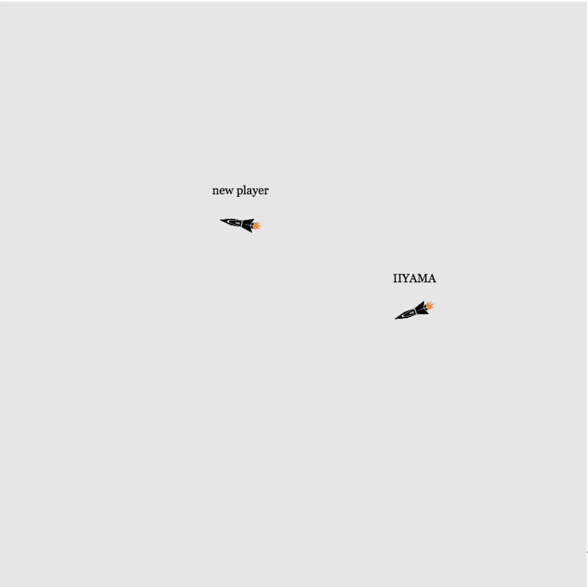

# Real Time Web course repo



Version 1.0.0

- [Assignment](ASSIGNMENT.md)

This web app lets you fly with your spaceship inside of an area. Every remote player that joins the website owns his own ship and will be streaming it's orientation to you.


## Navigation

- [Interaction](#interaction)
- [Express + sockets, which ports do I have to open?](#express--sockets-which-ports-do-i-have-to-open)
- [Expose when hosting on localhost](#expose-when-hosting-on-localhost)
- [Start the server!](#start-the-server)
- [Socket](#socket)
- [Socket events used](#socket-events-used)
- [Todo](#todo)


## Interaction

--- ; --------------- ; ---
--- MORE is COMING SOON ---
--- ; --------------- ; ---


## Express + sockets, which ports do I have to open?

Different ports for default express and using sockets.

```JS
const app = express();

// Start server
app.listen(3000, function() {
    console.log("Real-time-web APP listening at http://localhost:3000/");
});
```
Default express.

---

```JS
const socketApp = require("express")();
const server = require("http").Server(socketApp);
const io = require("socket.io")(server);

server.listen(4444);
```
Using express with sockets.

---

In this project I still want to use ejs templates so there are two different apps saved in to two different variables. The default app is running at port 3000 and the socket app is running at port 4444. This means that if you want to expose the website to the internet, you have to set 2 ports open.

## Expose when hosting on localhost

Enable connection and ports for your website:
```bash
npm run expose
```
Expose the webite to the internet, part 1. (main app)

---

```bash
npm run expose2
```
Expose the webite to the internet, part 2. (socket app)

---

### Edit clientside
You have to make a little change on the clientside, before exposing with ngrok is going to work.

---

1. Start gulp, so that you can start working in the `builder` folder. 
```bash
gulp
```
* Gulp will minify your scripts.
* Let you use scss and minify it.

---

2. Now open the file: builder/js/socket-connection.js

---

3. Edit the IP. (expose only)

```JS
const socket = io.connect('http://localhost:4444');
```
3.1 With localhost.

```JS
const socket = io.connect('http://XXXX.ngrok.io ');
```
3.2 When using ngrok, you have to replace the clienside io-connection-address with the IP of the socket app. !important!


## Start the server!

Before you start make sure the ports 3000 and 4444 are open.

Start the app.
```bash
npm start
```
## Socket

```HTML
<script src="https://cdnjs.cloudflare.com/ajax/libs/socket.io/2.1.0/socket.io.js"></script>
```
Download the socket script from cloudflare.

---

```JS
const socket = io.connect('http://localhost:4444');
```
Establish connection. `client`

---

```JS
io.on("connection", function (socket) {
    // , this function block created for each client.
});
```
A client has been connected. `server`

---

```JS
io.on("connection", function (socket) {
    
    socket.on("disconnect", function () {

    });
    
});
```
Detect when a client has been disconnected. `server`

---

```JS
socket.emit("event-name" /*, var ... */);
```
Trigger an event on clientside to serverside. `client >` server
Arguments can be passed.

---

```JS
io.on("connection", function (socket) {
    socket.on("event-name", function (/* var ... */) {

    });
});
```
Receive a trigger event on serverside. client `> server`. The parameters are containing the data that is attached to the event.

---

```JS
io.on("connection", function (socket) {
    io.sockets.to(socket.id).emit("event-name" /*, var ... */);
});
```

Trigger an event to a specific client on serverside to clientside. `server >` client.
Arguments can be passed.

---

```JS
io.on("connection", function (socket) {
     socket.broadcast.emit("event-name" /*, var ... */);
});
```

Trigger an event to all clients, `except the sender`, on serverside to clientside. `server >` client.
Arguments can be passed.

---

```JS
socket.on("event-name", function (/* var ... */) {

});
```
Receive a trigger event on serverside. server `> client`.

## Socket communication events used

### Server-side events

#### Build in
```JS
"connected"
"disconnect"
```

#### Custom (from client-side)
```JS
"ping_c"
"onStreamOrientation_c"
"onPlayerUsernameChange_c"
"onSyncProjectile_c"
```

### Client-side events 

#### Build in
```JS
"ping"
"connect_error"
"reconnect"

// experimental
"connect_timeout" 
```

#### Custom (from server-side)

```JS
"onSyncProjectile_s"
"onSyncProjectileDestroy_s"
"onPlayerDisconnect_s"
"onPlayerReconnect_s"
"onRemotePlayerReconnect_s"
"onRemotePlayerConnectionError_s"
"onStreamOrientation_s"
"onPlayerUsernameChange_s"
"onMapImageUpdate_s"

// experimental
"onPlayerConnect_s" 
```

## Other communications

### Open Weather Map
```JS
base64Img.requestBase64("https://tile.openweathermap.org/map/clouds_new/1/0/0.png?appid=", function(err, res, body) {
    mapImagesRequests.mapImage = {data: body};
});
```

Request a base64 image from the Open Weather Map API, every 10 seconds.
Requires the dependency: `base64-img` module.

By encoding it with base64, it is easier for the client to apply the image on to the canvas.

### Slack API

1. Link to slack oauth website
```HTML
<a href="https://slack.com/oauth/authorize?client_id=349357647332.350639213591&scope=identity.basic">Login with slack</a>
```

2. Confirm oauth request


3. Receive on serverside
```JS
/*
    Use a specific environment for the slack keys!
*/
require('dotenv').config()

const express = require('express');
const router = express.Router();
const fetchUrl = require("fetch").fetchUrl;

router.get("/oauth", function (req, res, next) {
    /*
        The slack API!
    */
    fetchUrl("https://slack.com/api/oauth.access?client_id=" + process.env.client_id + "&client_secret=" + process.env.client_secret + "&code=" + req.query.code + "&redirect_uri=http://localhost:3000/oauth", function(error, meta, data) {
        if (error == undefined) {
            data = JSON.parse(data);

            /*
                Save in a session if you want. (make sure to download the express session module)
            */
            req.session.slackAccessToken = data.access_token;
            req.session.slackUsername = data.user.name;
            
            res.redirect("/");
        }
    });
});

module.exports = router;
```

[Slack oauth documentation](https://api.slack.com/docs/oauth)


## Which data is available where?


## Todo
- [X] Added private and public player data. (The session socket ID is for example only available in the private data, and the user game ID is available in both.)
- [X] Stream orientation with remote players
- [X] Sync username with remote players
- [X] Clean up disconnected remote players.
- [ ] Collision detection
- [ ] Fix no focus on browser tab, which causes the animation frame to stop. This will cause desync, because the player spaceship animation goes on by the remote players.
- [ ] Slack API fix session bug.
